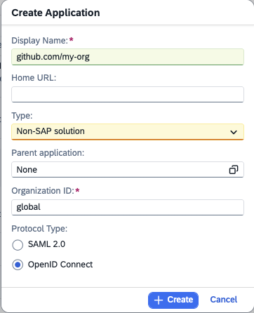
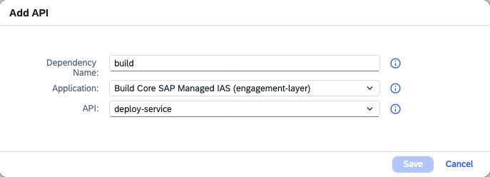

# GitHub Actions based deployment for Joule Studio

This repository demonstrates how to deploy a solution to Joule Studio using GitHub Actions.
Authentication is based on GitHub's OpenID Connect support: the workflow obtains a short-lived GitHub-issued JWT and exchanges it for a Cloud Identity Services token, which is then used to call the Joule Studio solution management API.

## Configuring the Cloud Identity Services Tenant

To authenticate against Joule Studio, the workflow uses a GitHub-issued JWT that is exchanged for a Cloud Identity issued JWT.

To enable this exchange, a configuration must be done in the Cloud Identity services tenant.

For general information about this exchange, see [the GitHub IAS integration guide][github-ias].

Here, we describe the necessary Joule Studio specific steps.
They are done in the admin console of the Cloud Identity services tenant.

1. Define an application representing the GitHub organisation

    In the section `Application & Resources` choose the tile `Applications`.
    Click `Create`.
    Fill out the dialog:

    

    The placeholder "my-org" is replaced with your GitHub organisation.
    Click "Save" and select the created application.

1. Define a dependency to the Joule Studio application

    Again in the tab `Trust` under `Application APIs` select `Dependencies`.

    Click `Add`.
    Fill out the dialog:

    

    Click `Save`.

    For more details, see the [Cloud Identity services documentation on Integrating Applications][help.sap---integrating-applications].

1. Specify trust with your GitHub repository.

    In the tab `Trust` in the section `Application APIs` select `Client Authentication`.
    Scroll down to `JSON Web Tokens`. Click the `Add` Button.

    Fill out the dialog:

    

    This is the token issuer URL for `github.com`:

        https://token.actions.githubusercontent.com

    Enter it in the field `Issuer` and click `Check for Metadata`. The field `JSON Web Key Set URI` will be populated automatically.

    Here is the template for the subject:

        repo:MY-ORG/MY-REPO:ref:refs/heads/main

    The placeholders "MY-ORG" and "MY-REPO" are to be replaced with your GitHub organisation and repository.

    Click "Save".

    Under `Client Authentication` the client ID is displayed.
    It is needed to define the `SCI_CLIENT_ID` variable below.

    For more details, see the [Cloud Identity services documentation on JWT bearer flows][help.sap--jwt-bearer-flow].


### Security Implications

This configuration allows GitHub workflows running on the main branch in `my-org/my-repo` to gain access to the solution management API of Joule Studio.

## Creating the Workflow

The following example workflow deploys a solution to Joule Studio.
It reads its configuration from repository variables and uses the following Joule Actions.

### Configuring Repository Variables

The workflow reads three variables from the GitHub repository.
Set them under **Settings → Secrets and variables → Actions → Variables**:

| Variable | Description |
|---|---|
| `SCI_TENANT_URL` | Issuer URI of the SAP Cloud Identity Services tenant (e.g. `https://my-tenant.accounts.ondemand.com`) |
| `SCI_CLIENT_ID` | Client ID of the SCI application created in the step above. |
| `SOLUTION_HANDLING_API_BASE_URL` | Base URL of the Joule Studio solution handling API |

### Workflow

In the repository which contains the solution, create the following file under `./github/deploy.yaml`.

```yaml
name: Deploy to Joule Studio

on:
  workflow_dispatch:

jobs:
  deploy:
    runs-on: ubuntu-latest
    permissions:
      id-token: write  # required for requesting the JWT
      contents: read   # required for actions/checkout
    steps:
      - name: Checkout repository
        uses: actions/checkout@v4

      - name: Fetch SCI token
        id: fetch-token
        uses: github.com/SAP/joule-actions/actions/token-fetch@v1
        with:
          cisTenantUrl: ${{ vars.SCI_TENANT_URL }}
          cisClientId: ${{ vars.SCI_CLIENT_ID }}

      - name: Zip solution
        id: zip-solution
        uses: github.com/SAP/joule-actions/actions/zip-solution@v1

      - name: Import solution
        id: import-solution
        uses: github.com/SAP/joule-actions/actions/import-solution@v1
        with:
          cisToken: ${{ steps.fetch-token.outputs.cisToken }}
          solutionHandlingApiBaseUrl: ${{ vars.SOLUTION_HANDLING_API_BASE_URL }}
          solutionZip: ${{ steps.zip-solution.outputs.solutionZip }}

      - name: Deploy solution
        uses: github.com/SAP/joule-actions/actions/deploy-solution@v1
        with:
          cisToken: ${{ steps.fetch-token.outputs.cisToken }}
          solutionHandlingApiBaseUrl: ${{ vars.SOLUTION_HANDLING_API_BASE_URL }}
          solutionId: ${{ steps.import-solution.outputs.solutionId }}
```

[github-ias]: https://github.wdf.sap.corp/pages/CPSecurity/sci-dev-guide/docs/Integration-Scenarios/GitHub-SCI
[help.sap--jwt-bearer-flow]: https://help.sap.com/docs/cloud-identity-services/cloud-identity-services/using-jwt-bearer-flow?version=Cloud
[help.sap---integrating-applications]: https://help.sap.com/docs/cloud-identity-services/cloud-identity-services/integrating-applications?version=Cloud&q=dependencies
